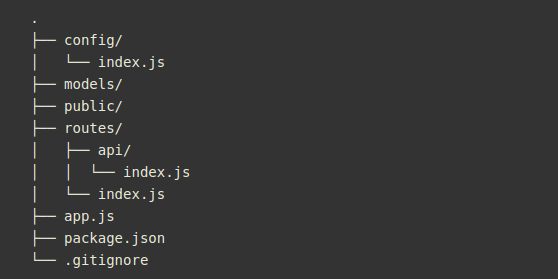

## **The Road to Building a Node/Express JSON API**

### **Initializing a Node Project**

Current folder structure used for building Node JSON API will look like the below:



- The `config` folder will be used for storing configuration settings for our application.
- The `models` folder will be used for storing our Mongoose models. These models will contain the schema for our data and will be the entry point for how our data gets in and out of MongoDB.
- The `public` folder is used for storing static files to be served, such as HTML, CSS, and Javascript files.
- The `routes` folder is where we define the routes that our application will respond to and will contain the logic for our endpoints.
- `app.js` is the entry point into our application. This is the file that node will execute and will bring together all parts of our application (routes, models, etc.).
- The `package.json` file is used by npm for declaring our dependencies and scripts for our application.

**Dependencies**

- `expressjs` - The server for handling and routing HTTP requests
- `express-jwt` - Middleware for validating JWTs for authentication
- `jsonwebtoken` - For generating JWTs used by authentication
- `mongoose` - For modeling and mapping MongoDB data to javascript
- `mongoose-unique-validator` - For handling unique validation errors in Mongoose. Mongoose only handles validation at the document level, so a unique index across a collection will throw an exception at the driver level. The mongoose-unique-validator plugin helps us by formatting the error like a normal mongoose ValidationError.
- `passport` - For handling user authentication
- `slug` - For encoding titles into a URL-friendly format

**Error Handling**

If a request fails any validations, expect a 422 and errors in the following format:
```js
{
  "errors":{
    "body": [
      "can't be empty"
    ]
  }
}
```
Other status codes:
- `401` for Unauthorized requests, when a request requires authentication but it isn't provided
- `403` for Forbidden requests, when a request may be valid but the user doesn't have permissions to perform the action
- `404` for Not found requests, when a resource can't be found to fulfill the request

### **Defining the API Spec**

